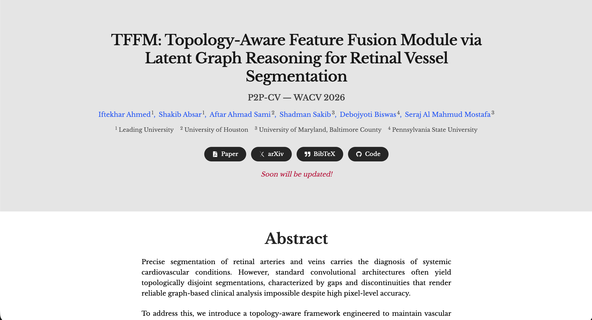

# TFFM Module Website

🌐 **Live Website:** [https://tffm-module.github.io/](https://tffm-module.github.io/)

This is the official website for the paper **"TFFM: Topology-Aware Feature Fusion Module via Latent Graph Reasoning for Retinal Vessel Segmentation"**.



## Deployment

The website is automatically deployed to GitHub Pages. After you are done with local development, run:

```bash
npm run deploy
```

This runs the `gh-pages` package to deploy the `dist` folder to the `gh-pages` branch.

## Tech Stack

- **React** with **TypeScript**
- **Tailwind CSS** for styling
- **Vite** for build tooling
- **gh-pages** for deployment to GitHub Pages

## Local Development

1. **Install dependencies:**

```bash
npm install
```

2. **Run development server:**

```bash
npm run dev
```

3. **Build for production:**

```bash
npm run build
```

4. **Deploy to GitHub Pages:**

```bash
npm run deploy
```

## 📄 License

MIT License - see the LICENSE file for details.
